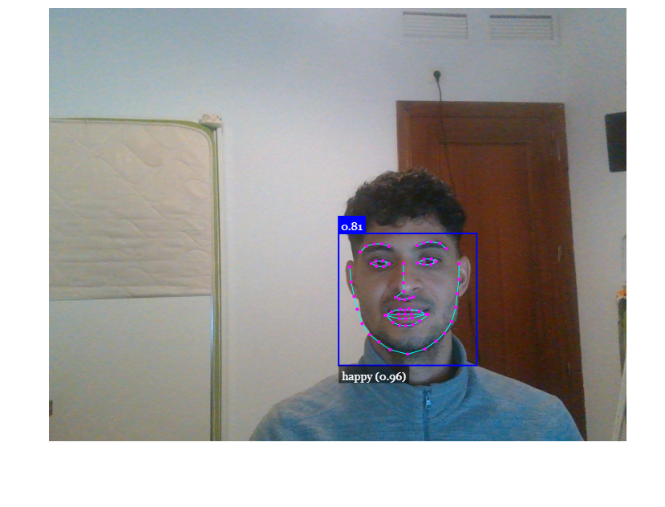

# Face Detection With JavaScript

A real-time face detection application built using face-api.js and JavaScript. This project uses a webcam feed to detect faces, showcasing how modern face detection models can be applied directly in the browser.

## Features

- Real-time face detection using a webcam.
- Lightweight and browser-based, no server-side dependencies required.
- Powered by face-api.js, a JavaScript library for face detection and analysis.
- Includes pre-trained models for quick and accurate detection.

## Built With

- HTML
- JavaScript

## [Live Demo](https://mhdez221993.github.io/face_detection/)

## Getting Started

To get a local copy:

- `git clone https://github.com/Mhdez221993/face_detection.git`
- `cd face_detection`

## Author

👤 **Moises Hernandez**

- [GitHub](https://github.com/Mhdez221993)
- [LinkedIn](https://www.linkedin.com/in/moises-hernandez-9bbb17145/)

## 🤝 Contributing

Contributions, issues, and feature requests are welcome!

Feel free to check the [issues page](https://github.com/Mhdez221993/face_detection/issues)

## Show your support

Give a ⭐️ if you like this project!
